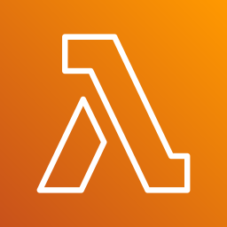
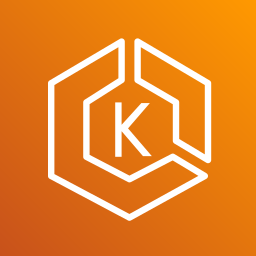

  
  &nbsp;
  
  &nbsp;
  

## About Me

<ul>
  <li>Year 3 at NTU's <strong>Renaissance Engineering Programme</strong></li>
  <li>B.Eng. in Computer Science + M.Sc. in Technology Management (Graduating <strong>Dec 2028</strong>)</li>
  <li>Currently: Year-Long Exchange in <strong>UC Berkeley</strong></li>
  <li>Previously: Data Engineering at <strong>Rakuten Viki</strong></li>
</ul>

## Featured Work
<table>
  <tr>
    <td width="50%" valign="top">
      
<a href="https://github.com/MT7654/Our-Grandparents-Shoes">ConverseBetter</a>

      
Conversation-training platform that helps youth volunteers practise empathetic communication with elderly seniors.>

    </td>
    <td width="50%" valign="top">
      
<a href="https://github.com/qorkjnxdk/Edufinder">EduFinder</a>

      
AI-powered school search and comparison platform with real-time government data and personalised recommendations.

    </td>
  </tr>
  <tr>
    <td width="50%" valign="top">
      
<a href="https://github.com/qorkjnxdk/DBFromScratch">DB From Scratch</a>

      
Learning more about database internals.

    </td>
    <td width="50%" valign="top">
      
<a href="https://github.com/NHS172k3/agentic-dating">Agentic Dating</a>

      
Controlled profile-evaluation simulator using computer-use agents to model synthetic dating-app personas.

    </td>
  </tr>
</table>

## Skills

### Languages

  

### Frameworks

  
  &nbsp;
  

### Tools

  

### Cloud

  
  
  &nbsp;
  
  &nbsp;
  

## Currently Working On

<input type="checkbox" /> Project about Database Internals

<input type="checkbox" /> Learn about Distributed Systems

